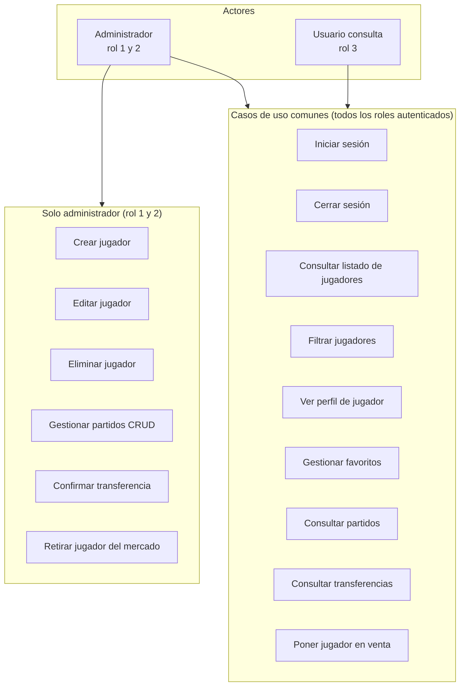

# 6.X Casos de uso por rol de usuario

## 6.X.1 Introducción

La aplicación **Elite Players** implementa un control de acceso basado en roles (RBAC simplificado). Cada usuario autenticado dispone de un identificador de rol almacenado en la tabla `usuarios` (campo `rol`). La lógica de autorización se centraliza en `PHP/auth.php`, mediante las funciones `requireLogin()`, `requireAdmin()` e `isAdmin()`.

### Roles definidos en el sistema

| ID | Nombre (BD) | Denominación en la memoria | Descripción |
|----|-------------|----------------------------|-------------|
| 1  | Admin       | **Administrador principal** | Acceso completo a funciones de gestión |
| 2  | Adminis     | **Administrador / gestor**   | Mismos permisos que el rol 1 en la aplicación actual |
| 3  | Consulta    | **Usuario de consulta**      | Acceso de lectura y funciones personales (favoritos, mercado) |

> **Nota de implementación:** En el código, los roles 1 y 2 se tratan de forma equivalente (`isAdmin()` comprueba `rol == 1 || rol == 2`). El rol 3 representa al usuario final que solo consulta y opera sobre su espacio personal.

### Usuarios de prueba

| Usuario    | Contraseña | Rol |
|------------|------------|-----|
| admin      | 1234       | 1   |
| madrid     | 1234       | 2   |
| visitante  | 1234       | 3   |
| Juanito    | 1234       | 3   |

---

## 6.X.2 Diagrama general de casos de uso

---

## 6.X.3 Matriz de permisos por funcionalidad

| Funcionalidad | Página / módulo | Rol 1–2 (Admin) | Rol 3 (Consulta) |
|---------------|-----------------|:---------------:|:----------------:|
| Iniciar / cerrar sesión | `Login.php`, `logout.php` | Sí | Sí |
| Listado y filtros de jugadores | `user.php` | Sí | Sí |
| Ver perfil (estadísticas, carta FIFA) | `player.php` | Sí | Sí |
| Añadir / quitar favoritos | `PHP/favoritotoogle.php` | Sí | Sí |
| Ver mis favoritos | `favorito.php` | Sí | Sí |
| Poner jugador en venta | `user.php` (POST) | Sí | Sí |
| Ver mercado de transferencias | `transferencias.php` | Sí | Sí (solo lectura) |
| Confirmar venta / asignar club destino | `transferencias.php` (POST) | Sí | **No** |
| Retirar oferta del mercado | `transferencias.php` (POST) | Sí | **No** |
| Crear jugador | `nuevo_jugador.php` | Sí | **No** |
| Editar jugador | `editar_jugador.php` | Sí | **No** |
| Eliminar jugador | `eliminar_jugador.php` | Sí | **No** |
| Consultar partidos | `partidos.php` | Sí | Sí |
| Crear / editar / eliminar partidos | `gestionar_partidos.php` | Sí | **No** |
| Enlace «Gestionar partidos» en navbar | `PHP/navbar.php` | Visible | Oculto |
| Botones editar / eliminar en tarjetas | `user.php` | Visible | Oculto |
| Botón «Nuevo jugador» | `user.php` | Visible | Oculto |

---

## 6.X.4 Casos de uso detallados — Rol 3 (Consulta)

### CU-C01 — Iniciar sesión
- **Actor:** Usuario de consulta.
- **Precondición:** Cuenta activa en `usuarios` con `rol = 3`.
- **Flujo principal:** Introduce credenciales en `Login.php` → el sistema valida usuario y contraseña → crea sesión (`user_id`, `user`, `rol`) → redirige a `user.php`.
- **Postcondición:** Acceso a las pantallas protegidas por `requireLogin()`.

### CU-C02 — Consultar y filtrar jugadores
- **Actor:** Usuario de consulta.
- **Descripción:** Visualiza el catálogo en `user.php` y aplica filtros por nombre, club, posición y rating mínimo (filtrado en cliente con JavaScript).

### CU-C03 — Ver perfil de jugador
- **Actor:** Usuario de consulta.
- **Descripción:** Accede a `player.php?id=X` y consulta datos biográficos, estadísticas (goles, asistencias, partidos), rating y observaciones. Puede interactuar con la carta FIFA (voltear).

### CU-C04 — Gestionar lista de favoritos
- **Actor:** Usuario de consulta.
- **Flujo:** Desde `player.php` o `favorito.php` añade o elimina jugadores en la tabla `favoritos` (relación `user_id` – `jugador_id`).
- **Restricción:** Solo modifica sus propios favoritos.

### CU-C05 — Poner jugador en venta
- **Actor:** Usuario de consulta (y cualquier usuario autenticado).
- **Descripción:** Desde una tarjeta en `user.php`, abre el modal de venta, indica precio y confirma. El sistema inserta un registro en `transferencias` con estado «En venta», si el jugador no está ya en el mercado.
- **Excepción:** Si el jugador ya está en venta, el botón aparece deshabilitado («Ya en venta»).

### CU-C06 — Consultar partidos y transferencias
- **Actor:** Usuario de consulta.
- **Descripción:** Navega a `partidos.php` y `transferencias.php` en modo solo lectura. No puede acceder a `gestionar_partidos.php` ni ejecutar acciones POST de administración en transferencias.

### CU-C07 — Intento de acceso a función restringida
- **Actor:** Usuario de consulta.
- **Flujo alternativo:** Accede directamente a URL de administración (p. ej. `editar_jugador.php`) → `requireAdmin()` redirige a `user.php` con mensaje flash de error.

---

## 6.X.5 Casos de uso detallados — Rol 1 y 2 (Administrador)

Incluye todos los casos del rol 3, más los siguientes:

### CU-A01 — Crear jugador
- **Página:** `nuevo_jugador.php` (`requireAdmin()`).
- **Descripción:** Alta de jugador con nombre, edad, posición, equipo, rating, foto y campos opcionales. Redirección al listado con mensaje de éxito.

### CU-A02 — Editar jugador
- **Página:** `editar_jugador.php?id=X`.
- **Descripción:** Modificación de datos y sustitución opcional de la imagen.

### CU-A03 — Eliminar jugador
- **Página:** `eliminar_jugador.php`.
- **Descripción:** Borrado transaccional del jugador y registros relacionados en `favoritos` y `transferencias` (por nombre de jugador).

### CU-A04 — Gestionar partidos (CRUD)
- **Página:** `gestionar_partidos.php`.
- **Operaciones:** Crear partido (equipos, goles, fecha, estadio, estado, logos), editar mediante formulario desplegable, eliminar por ID.

### CU-A05 — Moderar el mercado de transferencias
- **Página:** `transferencias.php` (bloque visible solo si `isAdmin()` y estado «En venta»).
- **Confirmar venta:** Asigna `club_destino`, opcionalmente actualiza precio, cambia estado a «Confirmado».
- **Quitar venta:** Elimina el registro de transferencia en estado «En venta».

---

## 6.X.6 Mecanismos de seguridad aplicados

1. **Sesión obligatoria:** Las páginas principales invocan `requireLogin()`; sin sesión → redirección a `Login.php`.
2. **Separación admin:** Páginas de mantenimiento usan `requireAdmin()`; rol 3 no puede ejecutarlas.
3. **Interfaz adaptativa:** Botones y enlaces de administración solo se renderizan si `isAdmin()` es verdadero (`user.php`, `navbar.php`, `transferencias.php`).
4. **Validación en servidor:** Las acciones POST de transferencias comprueban `isAdmin()` antes de confirmar o quitar ventas.

### Limitaciones conocidas (para futuras mejoras en la memoria)

- Las contraseñas se almacenan en texto plano en la versión actual.
- «Poner en venta» no está restringido por rol (cualquier usuario autenticado puede publicar en el mercado).
- Los roles 1 y 2 no se diferencian en permisos; la tabla `roles` existe en el esquema pero la aplicación usa el entero `usuarios.rol` directamente.

---

## 6.X.7 Resumen para la conclusión del TFG

El sistema distingue claramente entre **administración del catálogo y del calendario deportivo** (roles 1 y 2) y **consulta interactiva** (rol 3). El usuario de consulta dispone de un entorno completo para explorar jugadores, personalizar favoritos y participar en el mercado de fichajes simulado, mientras que la integridad de los datos maestros (jugadores y partidos) y la moderación de transferencias queda reservada a los perfiles administradores, alineado con un modelo típico de aplicación web con back-office y front-office de usuario final.
